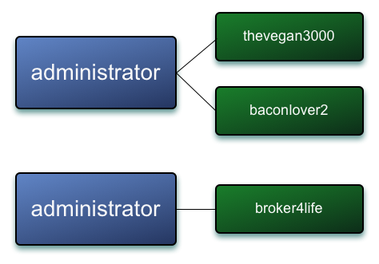
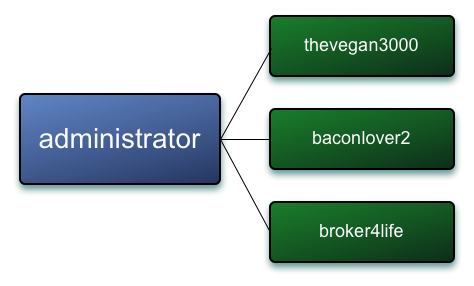
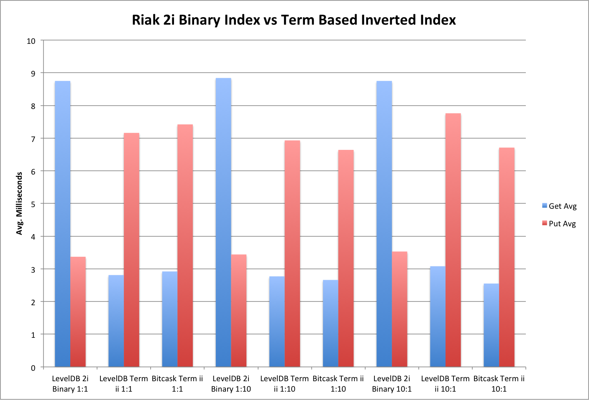
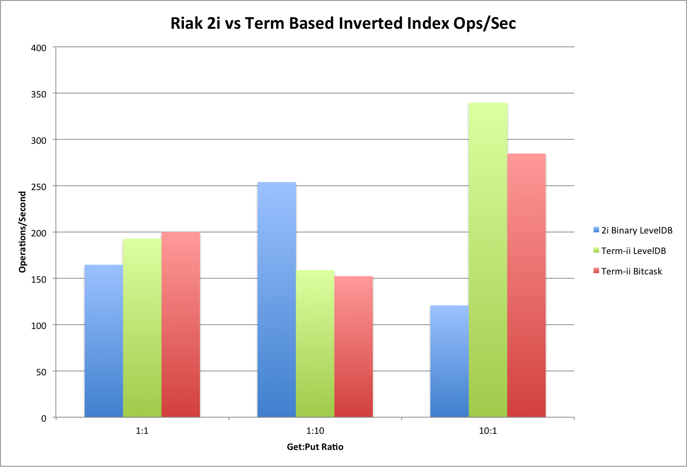

# Index for Fun and for Profit

## What is an Index?

In Riak, the fastest way to access your data is by its key.

However, it's often useful to be able to locate objects by some other value, such as a named collection of users. Let's say that we have a user object stored under its username as the key (e.g., `thevegan3000`) and that this particular user is in the `Administrators` group.  If you wanted to be able to find all users such as `thevegan3000` who are in the `Administrators` group, then you would add an index (let's say, `user_group`) and set it to `administrator` for those users.  Riak has a super-easy-to-use option called Secondary Indexes that allows you to do exactly this and it's available when you use either the LevelDB or Memory backends.

## Using Secondary Indexes
Secondary Indexes are available in the Riak APIs and all of the official Riak clients. Note that `user_group` becomes `user_group_bin` when accessing the API because we're storing a binary value (in most cases, a string).

### Add and retrieve an index in the Ruby Client:
	user_object = ruby_client['users'].get_or_new('thevegan3000')
	user_object.indexes['user_group_bin'] << 'administrator'
	user_object.store

	admin_user_keys = ruby_client['users'].get_index('user_group_bin', 'administrator')

### In the Python Client:
	user_object = python_client.bucket('users').get('thevegan3000)
	user_object.add_index('user_group_bin', 'administrator')
	user_object.store()

	admin_user_links = python_client.index('users', 'user_group_bin', 'administrator')

### In the Java Client:
	Bucket userBucket = riakClient.fetchBucket("users").execute();
	IRiakObject userObject = userBucket.fetch("thevegan3000").execute();
	userObject.addIndex("user_group_bin", "administrator");
	userBucket.store(userObject).execute();

	BinIndex binIndex = BinIndex.named("user_group_bin");
	BinValueQuery indexQuery = new BinValueQuery(binIndex, "users", "administrator");
	List<String> adminUserKeys = riakClient.fetchIndex(indexQuery);

## More Example Use Cases

Not only are indexes easy to use, they're extremely useful:

- Reference all orders belonging to a customer
- Save the users who liked something or the things that a user liked
- Tag content in a Content Management System
- Store a GeoHash of a specific length for fast geographic lookup/filtering without expensive Geospatial operations
- Time series data where all observations collected within a time-frame are referenced in a particular index

## What If I Can't Use Secondary Indexes?

Indexing is great, but if you want to use the Bitcask backend or if Secondary Indexes aren't performant enough, there are alternatives.

A G-Set Term Based Inverted Index has the following benefits over a Secondary Index:

- Better read performance at the sacrifice of some write performance
- Less resource intensive for the Riak cluster
- Excellent resistance to cluster partition since CRDTs have defined sibling merge behavior
- Can be implemented on any Riak backend including Bitcask, Memory, and of course LevelDB
- Tunable via read and write parameters to improve performance
- Ideal when the exact index term is known

### Implementation of a G-Set Term Based Inverted Index

A G-Set CRDT (Grow Only Set Convergent/Commutative Replicated Data Type) is a thin abstraction on the Set data type (available in most language standard libraries). It has a defined method for merging conflicting values (i.e. Riak siblings), namely a unioning of the two underlying Sets.  In Riak, the G-Set becomes the value that we store in our Riak cluster in a bucket, and it holds a collection of keys to the objects we're indexing (such as `thevegan3000`).  The key that references this G-Set is the term that we're indexing, `administrator`.  The bucket containing the serialized G-Sets accepts Riak siblings (potentially conflicting values) which are resolved when the index is read.  Resolving the indexes involves merging the sibling G-Sets which means that keys cannot be removed from this index, hence the name: "Grow Only".

#### `administrator` G-Set Values prior to merging, represented by sibling values in Riak

#### `administrator` G-Set Value post merge, represented by a resolved value in Riak

### Great! Show me the code!

As a demonstration, we integrated this logic into a branch of the [Riak Ruby Client][1].  As mentioned before, since a G-Set is actually a very simple construct and Riak siblings are perfect to support the convergent properties of CRDTs, the implementation of a G-Set Term Based Inverted Index is nearly trivial.

There's a basic interface that belongs to a Grow Only Set in addition to some basic JSON serialization facilities (not shown):

[gset.rb interface][2]

Next there's the actual implementation of the Inverted Index.  The index put operation simply creates a serialized G-Set with the single index value into Riak, likely creating a sibling in the process.

[inverted_index.rb put index term][3]

The index get operation retrieves the index value.  If there are siblings, it resolves them by merging the underlying G-Sets, as described above, and writes the resolved record back into Riak.

[inverted_index.rb get index term][4]

With the modified Ruby client, adding a Term Based Inverted Index is just as easy as a Secondary Index. Instead of using `_bin` to indicate a string index and we'll use `_inv` for our Term Based Inverted Index.

Binary Secondary Index: `zombie.indexes['zip_bin'] << data['ZipCode']`

Term Based Inverted Index: `zombie.indexes['zip_inv'] << data['ZipCode']`

### The downsides of G-Set Term Based Inverted Indexes versus Secondary Indexes
- There is no way to remove keys from an index
- Storing a key/value pair with a Riak Secondary index takes about half the time as putting an object with a G-Set Term Based Inverted Index because the G-Set index involves an additional Riak put operation for each index being added
- The Riak object which the index refers to has no knowledge of which indexes have been applied to it
    + It is possible, however, to update the metadata for the Riak object when adding its key to the G-Set
- There is no option for searching on a range of values (e.g., all `user_group` values from `administrators` to `managers`)

See the [Secondary Index documentation][5] for more details.

### The downsides of G-Set Term Based Inverted Indexes versus Riak Search
Riak Search is an alternative mechanism for searching for content when you don't know which keys you want.

- No advanced searching: Wildcards, boolean queries, range queries, grouping, etc

See the [Riak Search documentation][6] for more details.

## I'm from Missouri, the Show Me state. Let's see some graphs.

The graph below shows the average time to put an object with a single index and to retrieve a random index from the body of indexes that have already been written.  The times include the client-side merging of index object siblings.  It's clear that although the put times for an object + G-Set Term Based Inverted Index are roughly double than that of an object with a Secondary Index, the index retrieval times are less than half.  This suggests that secondary indexes would be better for write heavy loads but the G-Set Term Based Inverted Indexes are much better where the ratio of reads is greater than the number of writes.

Over the length of the test, it is even clearer that G-Set Term Based Inverted Indexes offer higher performance than Secondary Indexes when the workload of Riak skews toward reads.  The use of G-Set Term Based Inverted Indexes is very compelling even when you consider that the index merging is happening on the client-side and could be moved to the server for greater performance.

## Next Steps
- Implement other CRDT Sets that support deletion
- Implement G-Set Term Based Indexes as a Riak Core application so merges can run alongside the Riak cluster
- Implement strategies for handling large indexes such as term partitioning

[1]: https://github.com/basho/riak-ruby-client/tree/broker-inverted-index
[2]: https://github.com/basho/riak-ruby-client/blob/broker-inverted-index/lib/riak/crdt/gset.rb#L9-L21
[3]: https://github.com/basho/riak-ruby-client/blob/broker-inverted-index/lib/riak/index/inverted_index.rb#L14-23
[4]: https://github.com/basho/riak-ruby-client/blob/broker-inverted-index/lib/riak/index/inverted_index.rb#L25-L50
[5]: http://docs.basho.com/riak/latest/tutorials/querying/Secondary-Indexes/
[6]: http://docs.basho.com/riak/latest/tutorials/querying/Riak-Search/
