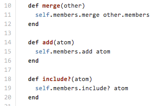
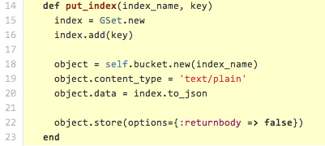
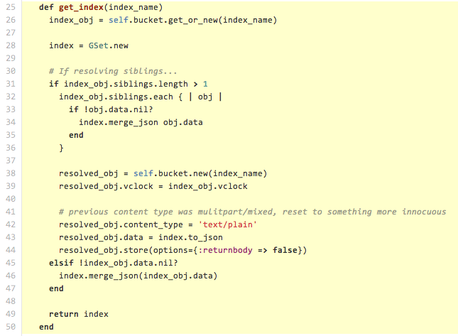

# Index for Fun and for Profit

## What is an Index?

In Riak, you access your data by knowing its key.  It's often useful to be able to access an object by another value that isn't its key such as which user group a user object belongs to.  A user object might have the key, "thevegan3000", where the key is the username and this particular user happens to be in the Administrators group.  If you wanted to determine if "thevegan3000" was in the Administrators group, then you would add an index for that user with the term "administrator" so you could search for Administrators later.  Riak has a super-easy to use option called Secondary Indexes that allows you to do exactly this and it's available when you use the LevelDB backend.

## Secondary Indexes are available in the Riak APIs and all of the official Riak clients.

### Add and retrieve an index in the Ruby Client:
	user_object = ruby_client['users'].get_or_new('thevegan3000')
	user_object.indexes['user_groups_bin'] << 'administrator'
	user_object.store

	admin_user_keys = ruby_client['users'].get_index('user_groups_bin', 'administrator')

### In the Python Client:
	user_object = python_client.bucket('users').get('thevegan3000)
	user_object.add_index('user_groups_bin', 'administrator')
	user_object.store()

	admin_user_links = python_client.index('users', 'user_groups_bin', 'administrator')

### In the Java Client:
	Bucket userBucket = riakClient.fetchBucket("users").execute();
	IRiakObject userObject = userBucket.fetch("thevegan3000").execute();
	userObject.addIndex("user_groups_bin", "administrator");
	userBucket.store(userObject).execute();

	BinIndex binIndex = BinIndex.named("user_groups_bin");
	BinValueQuery indexQuery = new BinValueQuery(binIndex, "users", "administrator");
	List<String> adminUserKeys = riakClient.fetchIndex(indexQuery);

## Not only are indexes easy to use, they're extremely useful:

- Reference all orders belonging to a customer.
- Save the users who liked something or the things that a user liked.
- Tag content in a Content Management System.
- Store a GeoHash of a specific length for fast geographic lookup/filtering without expensive Geospatial operations.
- Time series data where all observations collected within a time-frame are referenced in a particular index.

## Indexing sounds is exactly what I needed but what if I want to use the Bitcask backend or if the read performance Secondary Indexes isn't quite what I was expecting?

### How about a Term Based Inverted Index based on a G-Set CRDT? 

A G-Set Term Based Inverted Index has the following benefits over a Secondary Index:

- Better read performance at the sacrifice of some write performance
- Less resource intensive for the Riak cluster
- Excellent resistance to cluster partition since CRDTs have defined sibling merge behavior
- Can be implemented on any Riak backend including Bitcask, Memory, and of course LevelDB
- Tunable with Riak's CAP controls to further improve performance
- Ideal when the exact index term is known.

### Implementation of a G-Set Term Based Inverted Index

A G-Set CRDT, Grow Only Set Convergent/Commutative Replicated Data Type, is a thin abstraction on the Set data type (available in most language standard libraries). It also has a defined method for merging conflicting values (i.e. Riak siblings), namely a unioning of the two underlying Sets.  In Riak, the G-Set becomes the value that we store in our Riak Cluster in a bucket and it holds a collection of keys to the objects we're indexing such as, "thevegan3000".  The key that references this G-Set is the term that we're indexing, "administrator".  The bucket that the serialized G-Sets are written into accepts Riak siblings (potentially conflicting values) which are resolved when the index is read.  Resolving the indexes involves merging (a set union) the sibling G-Sets which means that keys cannot be removed from this index, hence the name Grow Only.

"administrator" G-Set Values prior to merging, represented by sibling values in Riak

"administrator" G-Set Value post merge, represented by a resolved value in Riak

### Great! Show me the code!

As a demonstration, we integrated this logic into a branch of the [Riak Ruby Client][1].  As mentioned before, since a G-Set is actually a very simple construct and Riak siblings are perfect to support the convergent properties of CRDTs, the implementation of a G-Set Term Based Inverted Index is nearly trivial.

There's a basic interface that belongs to a Grow Only Set in addition to some basic JSON serialization facilities (not shown):

[gset.rb interface][2]

Next there's the actual implementation of the Inverted Index.  The index put operation simply creates a serialized GSet with the single index value into Riak, likely creating a sibling in the process.

[inverted_index.rb put index term][3]

The index get operation retrieves the index value.  If there are siblings, it resolves them by merging the underlying G-Sets, as described above, and writes the resolved record back into Riak.

[inverted_index.rb get index term][4]

With the Ruby client modified, adding a Term Based Inverted Index is just as easy as a Secondary Index, the only difference being '_bin' for a 2i binary index and '_inv' for our Term Based Inverted Index.

Binary Secondary Index: `zombie.indexes['zip_bin'] << data['ZipCode']`

Term Based Inverted Index: `zombie.indexes['zip_inv'] << data['ZipCode']`

### The downsides of G-Set Term Based Inverted Indexes versus Secondary Indexes
- No index removal.
- Storing a key/value pair with a Riak Secondary index takes about half the time as putting an object with a G-Set Term Based Inverted Index because the G-Set index involves an additional Riak put operation for each index being added.
- Unlike a Secondary Index, the Riak object which the index refers to has no knowledge of which indexes have been applied to it.
- There is no option for searching based on a numeric range, which a 2i integer index is capable of, or a partial match, which a 2i binary index is capable of.

See the [Secondary Index documentation][5] for more details.

### The downsides of G-Set Term Based Inverted Indexes versus Riak Search
- No advanced searching: Wildcards, boolean queries, range queries, grouping, etc

See the [Riak Search documentation][6] for more details.

[1]: https://github.com/basho/riak-ruby-client/tree/broker-inverted-index
[2]: https://github.com/basho/riak-ruby-client/blob/broker-inverted-index/lib/riak/crdt/gset.rb#L9-L21
[3]: https://github.com/basho/riak-ruby-client/blob/broker-inverted-index/lib/riak/index/inverted_index.rb#L14-23
[4]: https://github.com/basho/riak-ruby-client/blob/broker-inverted-index/lib/riak/index/inverted_index.rb#L25-L50
[5]: http://docs.basho.com/riak/latest/tutorials/querying/Secondary-Indexes/
[6]: http://docs.basho.com/riak/latest/tutorials/querying/Riak-Search/