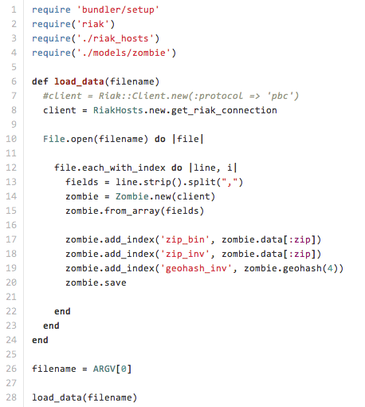
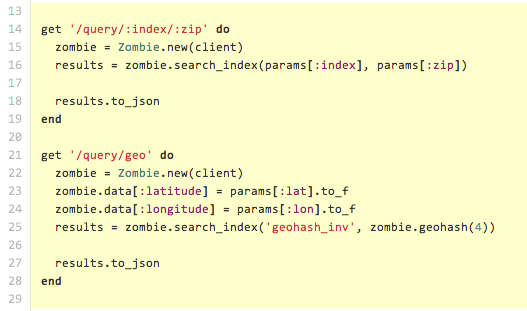
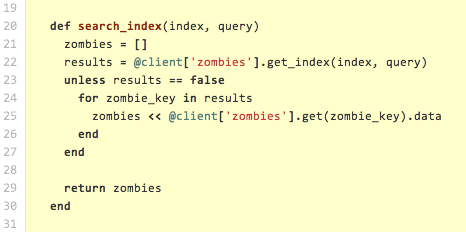
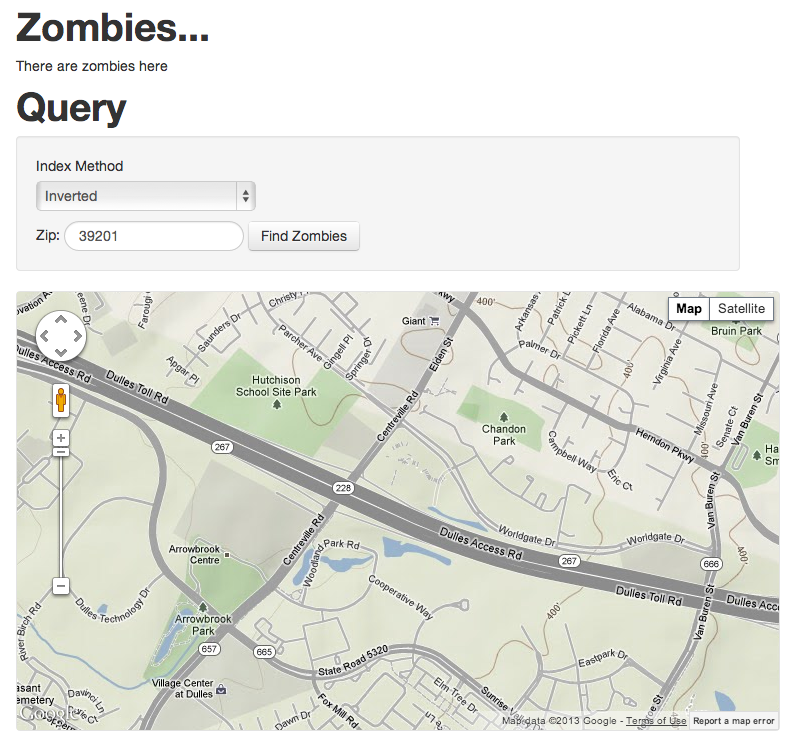
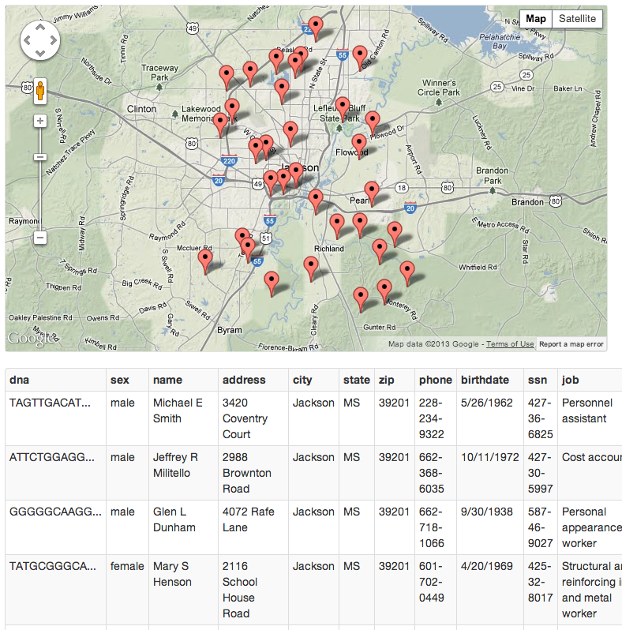
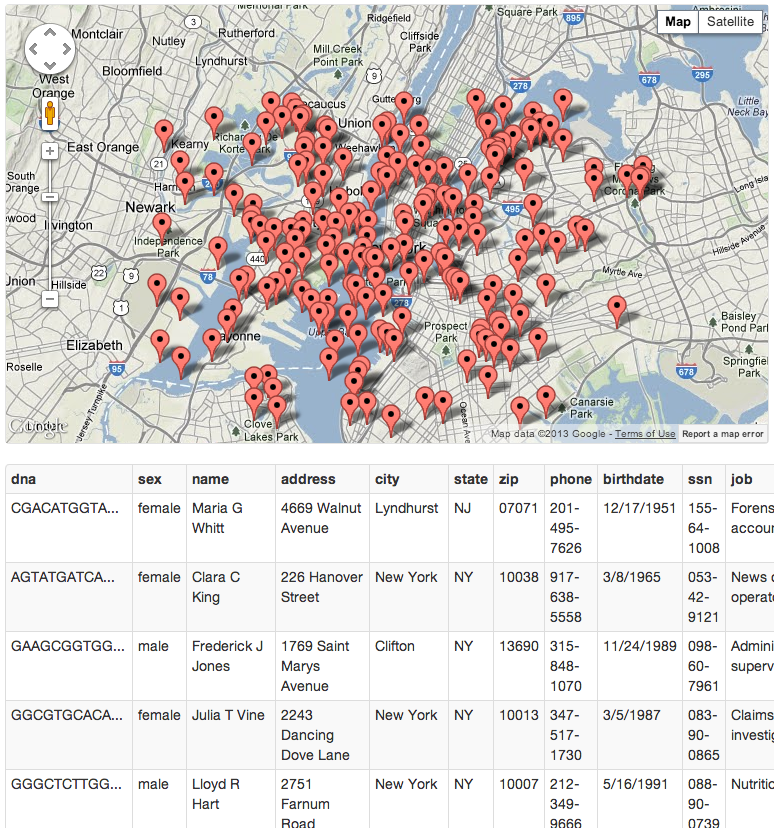

# The War against Zombies is still raging!

In the United States, the CDC has recovered 1 million Acute Zombilepsy vicitims and has asked for our help loading the data into a Riak cluster for analysis and ground team support.

## Know the Zombies, Know Thyself

The future of the world rests in a CSV file with the following fields:

1. DNA
2. Gender
3. Full Name
4. StreetAddress
5. City
6. State
7. Zip Code
8. TelephoneNumber
9. Birthday
10. National ID
11. Occupation
12. BloodType
13. Pounds
14. Feet Inches
15. Latitude
16. Longitude

For each record, we'll serialize this CSV document into JSON and use the National ID as the Key.  Our ground teams need the ability to find concentrations of recovered zombie victims using a map so we'll be using the Zip code as an index value for quick lookup.  Additionally, we want to enable a geospatial lookup for zombies so we'll also [GeoHash][0] the latitude and longitude, truncate the hash to 4 characters for approximate area lookup, and use that an index term.  We'll use the GSet Term-Based Inverted Indexes that we created since the dataset will be exclusively for read operations once the dataset has been loaded.  We've hosted this project at [Github][1] so that in the event we're over taken by Zombies our work can continue.

In our load script, we read the text file and create new Zombies, add Indexes, then store the record:

[load_data.rb script][2]

Our Zombie model contains the code for serialization and adding the indexes to the object:

[zombie.rb add index][3]

Let's run some quick tests against the Riak HTTP interface to verify that zombie data exists.

First let's query for a known zombilepsy victim:

`curl -v http://127.0.0.1:8098/buckets/zombies/keys/427-69-8179`

Next, let's query the inverted index that we created.  If the index has not been merged, then a list of siblings will be displayed:

Zip Code for Jackson, MS:  
`curl -v -H "Accept: multipart/mixed" http://127.0.0.1:8098/buckets/zip_inv/keys/39201`

GeoHash for Washington DC:  
`curl -v -H "Accept: multipart/mixed" http://127.0.0.1:8098/buckets/geohash_inv/keys/dqcj`

Excellent.  Now we just have to get this information in the hands of our field team. We've created a basic application which will allow our user to search by Zip Code or by clicking on the map.  When the user clicks on the map, the server converts the latitude/longitude pair into a GeoHash and uses that to query the inverted index.

### Colocation and Riak MDC will Zombie-Proof your application

First we'll create small Sinatra application with the two endpoints required to search for zip code and latitude/longitude:

[server.rb endpoints][4]

Our zombie model does the work to retrieve the indexes and build the result set:

[zombie.rb search index][5]

### Saving the world, one UI at a time

Everything wired up with a basic HTML and JavaScript application:

Searching for Zombies in the Zip Code 39201 yields the following:

Clicking on Downtown New York confirms your fears and suspicions:

The geographic bounding inherent to GeoHashes is obvious in a point-dense area so in this case it would be best to query the adjacent GeoHashes.

### Keep fighting the good fight!

There is plenty left to do in our battle against Zombies!

- Zombie Sighting Report System so the concentration of live zombies in an area can quickly be determined based on the count and last report date.
- Add a crowdsourced Inanimate Zombie Reporting System so that members of the non-zombie population can report inanimate zombies. Incorporate Baysian filtering to prevent false reporting by zombies. They kind of just mash on the keyboard so this shouldn't be too difficult.
- Add a correlation feature, utilizing Graph CRDTs, so we can find our way back to Patient Zero.

[0]: http://en.wikipedia.org/wiki/Geohash
[1]: http://github.com/drewkerrigan/riak-inverted-index-demo/
[2]: https://github.com/drewkerrigan/riak-inverted-index-demo/blob/master/load_data.rb
[3]: https://github.com/drewkerrigan/riak-inverted-index-demo/blob/master/models/zombie.rb#L66-L68
[4]: https://github.com/drewkerrigan/riak-inverted-index-demo/blob/master/server.rb#L13-L29
[5]: https://github.com/drewkerrigan/riak-inverted-index-demo/blob/master/models/zombie.rb#L19-L31

